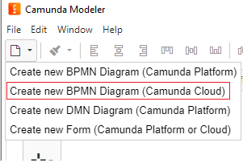
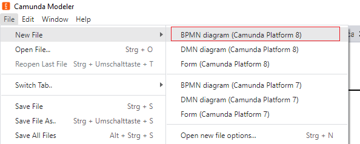
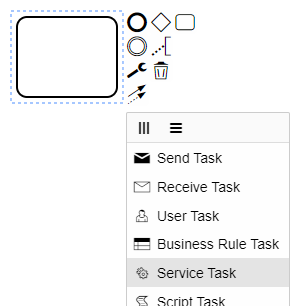
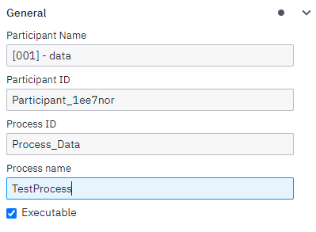
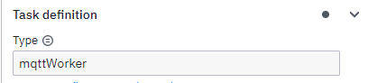
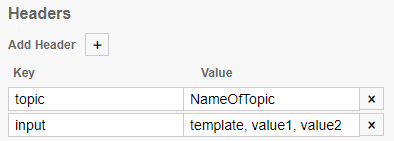
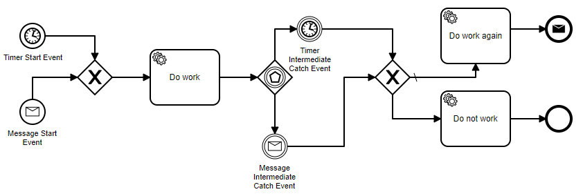

# BPMN Service Description
Pre-requisites
- [Camunda Modeler](https://camunda.com/download/modeler/)
- Docker and Docker Compose
- (optional) MQTT Client for testing

The BPMN-Service requires a configuration file, which contains basic configuration, such as:
- MQTT URL, port, timeout, QoS and encryption data if necessary (username/password and certificates)
- MQTT topic prefixes (which gets prepended before the service names within the BPMN diagram)
- the address of the Zeebe gateway (defined within the docker-compose file of the service framework)
- the name of the correlation-key identifier used in the BPMN diagram


An example looks like the following (encoded as .yaml):

```
zeebe:
  client:
    broker:
      gatewayAddress: zeebe:26500
    security.plaintext: true # used to disable tls for developing
mqtt:
  debugging: false
  broker:
    ip: mqttbroker
    port: 1883
    qos: 0
    timeout: 60
    username: bpmnservice
    password: bpmnservice_password
    useUsernamePassword: false
    useCertificates: false
  topics:
    prefix:
      services: services
      message: message
bpmn:
  key_identifier: correlationKey
```

## BPMN: supported Activities, Gateways and Events
Supported are:
- Activities
  - Service Task
  - Send Task
  - User Task
- Gateways
  - Exclusive
  - Parallel
  - Event-based
- Events
  - Message Start Event
  - Timer Start Event
  - Start Event
  - End Event
  - Message End Event
  - Error End Event
  - Message Intermediate Catch Event
  - Message Intermediate Throw Event
  - Intermediate Throw Event
  - Timer Intermediate Catch Event
## Camunda Modeler create new workflow
In order to create a new workflow, start the Camunda Modeler and create a new BPMN Diagram file (Camunda Cloud), as seen in the figure below (for version 4.9 and 5.0):\
Version 4.9:
\
Version 5.0:
\
This enables to create activities, gateways and events which the BPMN-Service can read and manage.\
After adding and placing one of the objects via the panel on the left, a small wrench icon in the menu on the right side of the object indicates the possibility to change the type of the object.\
In case of a activity, it allows to change from the default "task" to a "Service Task", see next Figure:\
\
The current implementation of Zeebe, which is integrated into the BPMN-Service, does support:
- Service Task
- Send Task
- User Task

### Naming of workflows
In order to better distinguish between workflows, a suitable name can be set. This can either be done by clicking into an empty space if no pool is in the workflow, or selecting a pool and access the properties on the right side. There the "Process ID" or "Process name" can be set, which is then visible in Operate:\


### Service Task
After giving a name to a service task, a type has to be defined. In order to work with the BPMN-Service this type has to be "mqttWorker":\
\
This indicates to the BPMN-Service, that this taks should trigger a service reachable via MQTT.\
For this, another important concept has to be defined, the name of the topic, to which the BPMN-Service should publish messages to and should receive their responses. For this, within the "Headers" category, the "key" and "value" have to be set accordingly. The "key" has to "topic", while the "value" can be an arbitrary string (no spaces or special characters):\
\
Additionally, it is possible to define what key/value pairs are to sent to the service, which is specified by the "input"-key. Pre-requisite is that the payload is json encoded.\
The resulting MQTT topic used by the BPMN-Service compose of the prefix defined in the BPMN-Service (prefix.services) and the NameOfTopic of the services as defined in the key/value pair of the service activity. The BPMN-Service will additionally append "request/someID" in order to correlate requests and reponses.\
_E.g. prefix/NameOfTopic/request/123_

### Send Task
Similar to the Service Task, the Send Task has to have a specific type, namely "sendMessageWorker", and a "topic" as key in the "Headers" category.\
This indicates, that after reaching this task, a message with all variables of the workflow (for now) is send to the specified topic by the BPMN-Service.\
The resulting MQTT topic is similar to the service task composed of the (prefix.message) prefix and the name of the topic as defined in the activity:\
_E.g. prefix/messageToTopic_
### User Task
User tasks can be handled by accessing [Simple-Tasklist(https://github.com/camunda-community-hub/zeebe-simple-tasklist), an open source worker with web interface for managing user tasks in a workflow. ([http://localhost:8081/](http://localhost:8081/))

### Events
Events can be divided into three categories: Start, intermediate and end events.\
Start events in this case both are triggered by message (Message start event) or by a timer (Timer start event).\
Intermediate events again are either triggered by a message or a timer.
End events can either be normal end events, which just close the instance of the workflow, or message end events, which can be defined to send a message and afterwards complete the instance.\
\

# MQTT Topics used by the BPMN Service

## Topic description
### Topic prefix
**Service topics**: prefix/services\
**Message topic**: prefix/message
### Normal services
- **Normal Service**: normal

As these services are called by the BPMN-Service, they will wait for a message on the corresponding request topic.\
Therefore, each of these services has to listen for the correct topic, which composes of the prefix + servicename + /request/"ID".\
The "ID" is used to correlate requests and responses together, and has to be appended to the response topic.\
The input and output payload of each service should be described within the service folder

**Example** - Request for the normal service: _prefix/services/normal/request/123456789_\
**Example** - Response from the normal service: _prefix/services/normal/response/123456789_

### Utility services/Services described as workflows:
- **Test Workflow**: testworkflow

These service compose of different "normal" services and therefore start a BPMN-Process within the BPMN-Service as soon as a message arrives on the corresponding topic.\
**Example** - Request for TestWorkflow: _prefix/services/testworkflow_\
Their payload should be defined in a well managed document.

# Service
## Simple-Monitor
[http://localhost:8082/](http://localhost:8082/) \
Allows to manage BPMN processes and see current states.

## Simple-Tasklist
[http://localhost:8081/](http://localhost:8081/) \
Allows to manage user tasks

# HowTo Docker

For starting the framework, navigate to the root folder it's repository (where the `docker-compose.yml` file is located). This is necessary, as the later command requires an input file, in which all services and the configuration is defined.
\
Then open a terminal/commando window in this root folder and type the following code for starting the framework:
 \
 `docker compose up -d` (attach --build if starting for the first time or if changes were made to any service requiring the --build command (BPMNService, ...), e.g.  `docker compose up -d --build`) (or use the older docker-compose command)
 \
This starts the framework in detached (-d) mode, meaning you can savely close the terminal and the containers will still be running.
\
Configuration variables can be written within a .env file, e.g. for the project name and some port definitions for a less error prone deployment.
\
For stopping the whole framework use this command (again, terminal in this root folder):
 \
 `docker compose down`
 \
By using `docker ps` it is possible to view all running containers and see the names of them. With this, after starting the framework, all within the .yml file defined containers (services) should be up and running. Other commands may be of relevance:
- `docker stop <container_name>` stops the container
- `docker start <container_name>` start the container
- `docker restart <container_name>` restarts the container
- `docker logs <container_name>` outputs the log of container (append `-f` to get a continuous log output)